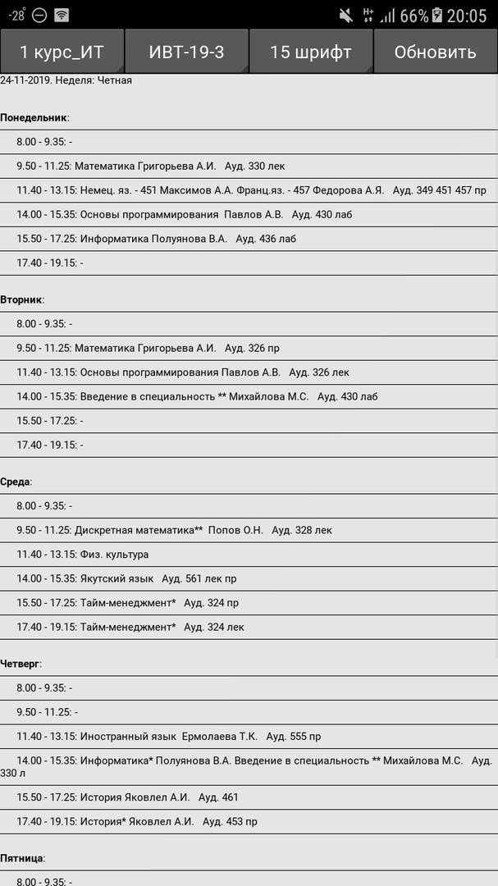
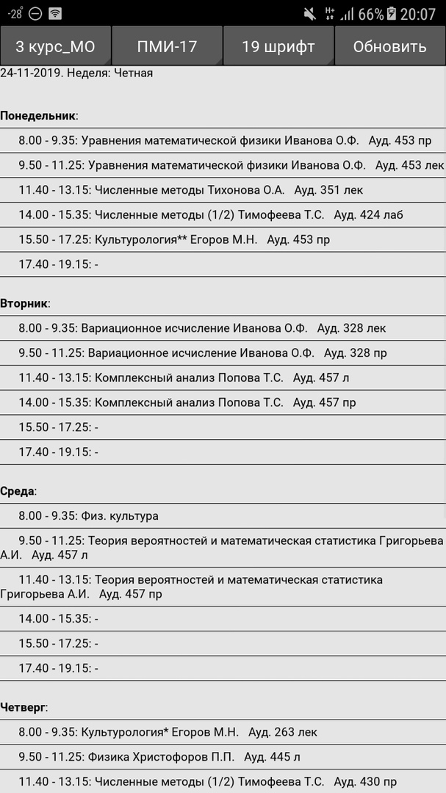
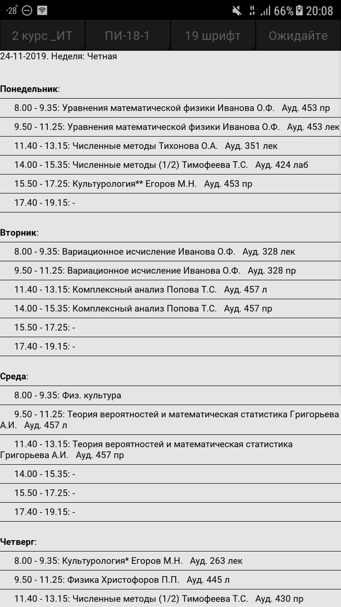

# USchedule
Приложение служит для формирования расписания в приятный для глаз формат.

---
Написано на языке Python с использованием фреймворка Kivy.

---
О том, как устанавливается этот пакет, можно узнать на официальном сайте : https://kivy.org/doc/stable/gettingstarted/installation.html (заблокирован на территории РФ).

---
Упаковка в .apk-файл производилась на виртуальной машине с операционной системой Ubuntu 18.04 при помощи пакета buildozer.

---
### Использование:
- при первом запуске поле с расписанием будет пустым. Чтобы получить расписание выберите ваш курс, вашу группу и нажмите кнопку "Получить"; при каждом последующем запуске будет отображаться последнее полученное расписание;

- для обновления таблицы используется соответствующая кнопка "Обновить";

- если вы, например, получили расписание для группы ИВТ-19-1, но хотите изменить его на расписание группы ИВТ-19-2, то выберите соответствующую группу в селекторе групп и нажмите кнопку "Получить";

- изменение размера шрифта производится с помощью соответствующего селектора;
---

### Общий принцип работы:
- при нажатии кнопки "Получить" или "Обновить" программа ищет на сайте СВФУ в разделе расписания ИМИ последнее вышедшее расписание;
- если актуальное расписание не было загружено, оно скачивается в виде .doc-файла и далее читается и формируется в .json-файл с учетом выбранного курса и группы;
- если актуальное расписание уже было загружено программой, то производится переформирование .json-файла расписания с изменением даты, которая указанна в правом верхнем углу таблицы расписания в приложении;
---

### Примеры

---

---
- Пример загрузки расписания иной выбранной группы

